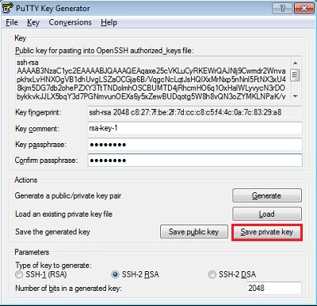

윈도우의 경우 Putty를 사용합니다.
# 필요파일을 다운로드
- [putty](https://the.earth.li/~sgtatham/putty/latest/w64/putty.exe)
- [puttygen](https://the.earth.li/~sgtatham/putty/latest/w64/puttygen.exe)

# key 를 생성

1. puttygen 을 실행하고 Generate 를 클릭한다.

    

1. puttygen 애플리케이션 안에서 마우스를 계속 움직인다. 마우스를 움직여야 키가 생성된다.

    

1. Save private key 를 선택하여 private key를 저장한다. (예: privatekey.ppk)

    

1. **Public key for pasting into OpenSSH authorized_keys file:** 항목의 내용을 모두 복사한다.   이 내용이 public key 값이다.

    

1. 복사한 public key값을 저장한다. (예: publickey.pub)

이렇게 public/private key 쌍을 준비해 놓고 다음 진행을 합니다.  
위의 과정으로 만들어진 key  값들은 다음과 같습니다.
- [publickey.pub](./files/publickey.pub)
- [privatekey.ppk](./files/privatekey.ppk)

이미 만들어진 key를 다운로드 하여 사용하도록 합니다.

---
완료하셨습니다.