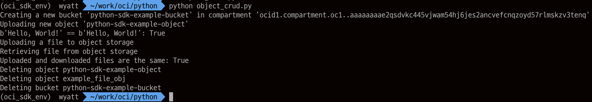
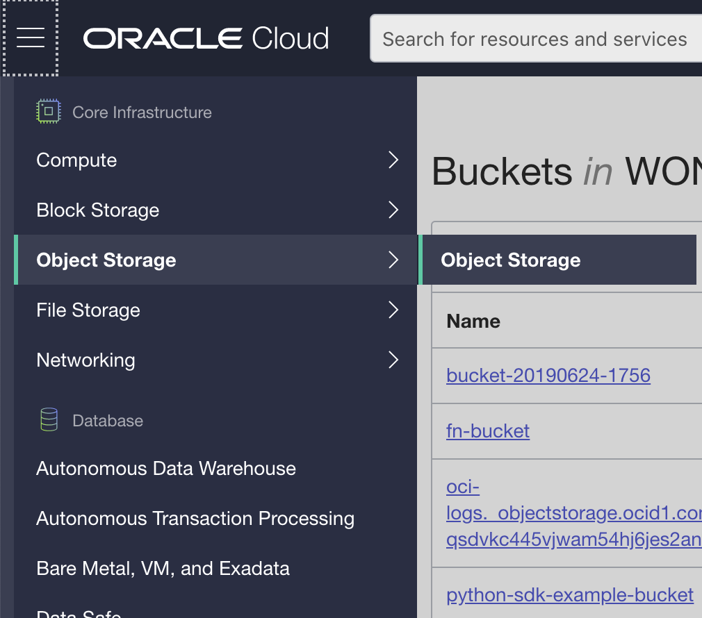
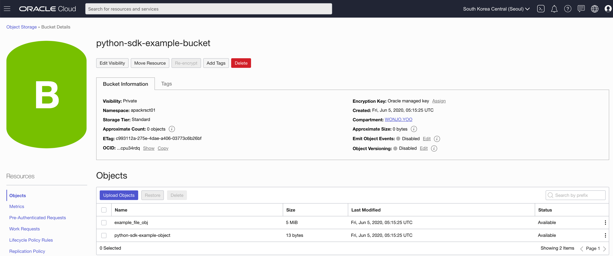

# Python SDK 사용하기
Python SDK를 사용하는 과정을 수행해 봅니다.

사전 준비과정으로 OCI CLI를 설치하게 되면 Config 파일은 해당 계정의 .oci/config 에 위치하게 됩니다.

본 Lab에서는 간단한 Sample을 테스트 해봅니다. 보다 자세한 설명은 아래의 링크를 참조 하시기 바랍니다.

https://oracle-cloud-infrastructure-python-sdk.readthedocs.io/en/latest/installation.html#set-up-a-virtual-environment

## Python SDK 설치 
Python 3.5 or 3.6 필요합니다.
1. [Python 설치](https://wiki.python.org/moin/BeginnersGuide/Download)
1. virtual env 설치
	
    python이 정상적으로 설치된 경우 아래의 명령어를 실행해서 가상환경을 만듭니다.
    pip install virtualenv
    
2. virtualenv oci_sdk_env

    source oci_sdk_env/bin/activate

3. pypi 설치

    pip install oci

4. SSL 버전 확인

    python -c "import ssl; print(ssl.OPENSSL_VERSION)"

    * 1.0.1 보다 낮은 경우 다음 실행합니다.
    - pip install requests[security]==2.18.4 

## 예제 다운로드 후 실행

아래 예제는 object storage에 python-sdk-example-bucket 이라는 이름으로 bucket 을 생성하고 파일을 하나 생성해서 upload 후 download까지 하는 예제입니다. 실행 후에는 object storage에 있는 bucket과 파일을 삭제합니다.

[object_crud.py 다운로드](https://github.com/oracle/oci-python-sdk/blob/master/examples/object_crud.py)

## Object Storage File Upload 샘플 실행
python을 실행하기 위해서는 위의 source oci_sdk_env/bin/activate 를 수행한 후에 하셔야 합니다.
```
    python object_crud.py
```
정상 실행 결과



#### 소스 변경 필요한 부분

위 예제들은 tenancy id와 compartment_id를 동일한 경우에 해당 하는 예제이므로 이 부분을 확인 하여 다음과 같이 변경 하시기 바랍니다.
```
compartment_id = config["tenancy”] —> compartment_id ='ocid1.compartment.oc1..XXXX’
```

object_crud.py 소스에 보면 아래와 같이 from_file()에 인자가 없습니다.
```
    config = oci.config.from_file()
```
디폴트 경로인 oci cli 파일 위치로 부터(해당 계정의 home의 .oci 폴더) config 파일을 불러옵니다.

## 소스 변경 후 object file 확인하기
소스를 편집기로 열어서 뒷 부분에 delete하는 부분을 # 주석으로 막습니다.
```
    #object_storage.delete_object(namespace, bucket_name, object_name)object_storage.#delete_object(namespace, bucket_name, example_file_object_name)
    #object_storage.delete_bucket(namespace, bucket_name
```
다시 위의 소스를 실행합니다.
```
    python object_crud.py
```
이제 OCI 콘솔 화면에서 object storage 로 이동합니다.



bucket이 생성된 것을 확인할 수 있습니다. bucket 안으로 들어가서 파일의 내용을 확인하면 다음과 같이 파일이 생성된 것을 확인 할 수 있습니다.



## 대용량 전송 테스트 
위와 동일한 방식이나 아래 예제는 대용량을 전송을 위한 예제입니다.
이 파일도 위와 같이 compartment_id 부분을 수정한 후 테스트를 합니다.
이 파일은 파일을 upload시에 분할해서 전송하는 방식으로 최대 10000개로 파일을 분할 해서 올릴 수 있고, 1개 파일의 최대 사이즈는 50GB 입니다.

https://github.com/oracle/oci-python-sdk/blob/master/examples/multipart_object_upload.py

---
이 과정을 완료하셨습니다.