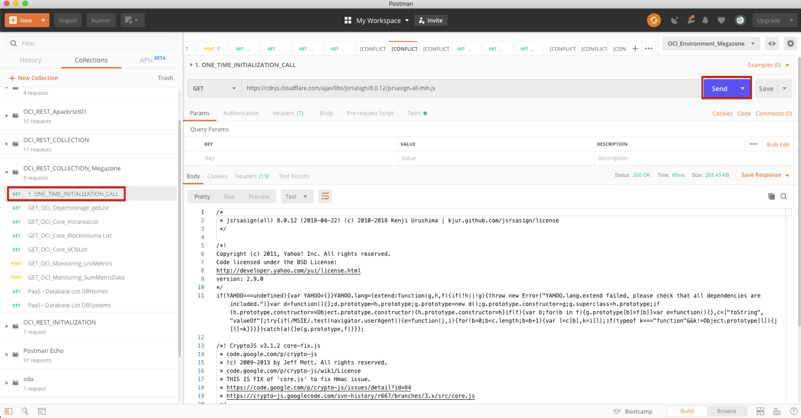

# REST API 호출하기
OCI는 SDK를 통해서 모든 자원에 접근할 수 있고, REST API를 통해서도 호출이 가능합니다.
이번 Lab에서는 REST API를 호출하는 실습을 수행해보겠습니다.

모든 REST API는 아래의 주소에서 확인하실 수 있습니다.

https://docs.cloud.oracle.com/iaas/api/#/

## Postman download
[다운로드](https://www.postman.com/downloads/)

## 실습 스크립트 다운로드
[postman 스크립트 다운로드](./files/OCI_REST_COLLECTION.postman_collection.json)

[postman 환경파일 다운로드](./files/OCI_Environment.postman_environment.json)

## 스크립트를 사용한 호출
1. 미리 준비된 스크립트 collection 파일과 환경 파일을 Postman에 추가해서 테스트 해봅니다.
첨부한 json 파일을 postman 툴에서 import 합니다.

1. 미리 환경 변수들이 세팅되어 있는 Environment 선택합니다.

1. ONE_TIME_INITIALIZATION_CALL 호출 (처음 1회만 호출)

1. 모니터링 URL 호출
호출 주소, 파라미터는 REST API Document 에서 확인 Sample로 준비된 주소 호출하여 결과 확인

